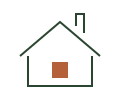

# EKAM Human Interface System

> The operating spine for every interactive surface EKAM ships.
> Read this before designing. Refer back during. Check against before merging.

---

## 0 · How to use this document

This is the **product-interface layer** of the EKAM design system. The brand layer — voice, palette, type families, taglines, photography direction — lives in `README.md` and `colors_and_type.css`. Do not duplicate that. Read it once, then come here.

When you sit down to design or build a new module, the order is:

1. **Read §1–§3** of this document. (Five minutes.) These are the laws and the refuse list. They will kill 80% of the decisions before you make them.
2. **Read §10 — Module Recipe** when you start the module. It is a step-by-step.
3. **Hold §13 — the QA gate** open in a second tab while you work.
4. When something feels off, return to §4 — the Decision Gate.

If this document and `README.md` disagree, this document wins (it is newer and more specific). If this document and a live screen disagree, the document wins and the screen is wrong — log it in `EKAM Drift Audit.md`.

### Glossary

- **Surface** — any rendered region the user sees (screen, sheet, panel, card).
- **Chapter** — a top-level mobile section (Onboarding, Home, Property, Saved, Profile, Companion). Each lives in its own folder.
- **Primitive** — a low-level component (button, field, card, sheet) that all chapters share.
- **Module** — a feature that spans one or more screens within a chapter.
- **MUST / MUST NOT** — binding. Violations are bugs.
- **SHOULD / SHOULD NOT** — strong default. Deviating requires a written reason.
- **MAY** — allowed.

---

## 1 · The product, in one paragraph

EKAM is a network of off-grid cabins in the Indian Himalayas. The mobile app is the calm digital companion around that experience: discover, intend, arrive, stay, leave, return. It is **not a booking marketplace, not a content feed, not a social app, not a loyalty program**. The cabin and the land are the product. The app's job is to defer to them.

Every screen answers one of seven questions, no more:

| Chapter | Question |
|---|---|
| Onboarding | *Where am I, and what is this?* |
| Home & Discovery | *What cabins exist, and which one is mine?* |
| Property & Booking | *Is this the one? When can I be there?* |
| Saved & Membership | *What did I keep, and what do I belong to?* |
| Profile, Mudra & Referral | *Who am I to EKAM?* |
| Companion (in-stay) | *I am here. What now?* |
| Network | *Where else can EKAM take me?* |

If a proposed feature does not extend one of these seven questions, it does not belong in the app.

---

## 2 · The five laws

Non-negotiable. Every design decision passes through them.

### Law 1 — Radical Calmness

The interface never raises its voice. The cadence is a person sitting on a porch, not a person clearing a queue.

- MUST NOT show notification badges, red dots, count pips, or unread indicators.
- MUST NOT use urgency language ("Book now", "Only 2 left", "Last chance").
- MUST NOT auto-advance carousels, autoplay video, or run ambient animation loops.
- MUST treat empty states as pauses, not as apologies.

### Law 2 — Intentional Restraint

The default answer to "should we add this?" is no. Every element earns its place.

- MUST have at most one H1 per screen.
- MUST have at most one primary CTA per screen. Secondary actions are text links.
- MUST NOT add decorative icons. Icons exist only when a word would be slower to recognise.
- MUST treat whitespace as content. Do not fill it because it feels empty.

### Law 3 — Nature as Primary Interface

The cabin and the land are the protagonist of every screen. UI chrome defers.

- MUST keep photography large, uncluttered, and unbranded — no logo overlays on imagery.
- SHOULD place text *beside* an image, not on top of it. Overlays only when the image is a full-bleed atmospheric backdrop and a single line of text is essential.
- MUST use forest, sand, ink, cream, bone, mist as the field. Clay is ceremony, not decoration.
- MUST NOT use gradients on UI surfaces. (Photo-legibility scrims behind essential overlay text are the *only* exception; see §5.)

### Law 4 — Operational Simplicity

A guest mid-trip with one bar of signal can complete any task. The system never makes the user think about the system.

- SHOULD reach every primary task in ≤2 taps from the home tab.
- MUST NOT nest navigation past two levels (tab → chapter → detail; nothing further).
- SHOULD limit forms to ≤5 fields per screen. Split longer flows into steps.
- MUST write error states in human English. "Try again" is better than "Error 503: upstream failure."

### Law 5 — Timeless Modularity

We design for ten years, not ten months.

- MUST NOT use neumorphism, glassmorphism, AI-glow, brutalism, frosted glass, or any chrome trend whose name ends in "-ism".
- MUST use the locked type stack: Cormorant Garamond (display + editorial), Raleway (long-form body), Inter (UI labels), Tiro Devanagari Hindi (Sanskrit), Caveat (host hand). No additions without a brand decision.
- MUST keep hard edges. `--r: 0px` is the default radius. The CTA pill is the *only* exception.

---

## 3 · The Refuse List

Twenty-five things EKAM will not do, ever. Each is a tripwire. If a screen has one, it does not ship.

1. **No gradients on UI surfaces.** Backgrounds are flat tones from the palette. Photo scrims for legibility are the only exception, and they must be necessary.
2. **No drop shadows on UI surfaces.** Elevation is hairline + tone. Only physical-artifact illustrations (the journal, wax seal, welcome card) earn paper shadow.
3. **No emoji.** Anywhere in the product. Not in copy, not in eyebrow labels, not in empty states, not in push notifications.
4. **No icon-only buttons for primary actions.** Words are honest.
5. **No animated counters, no count-up reveals, no live "people are looking now" widgets.**
6. **No autoplay video.** Tap to play; muted by default; controls hidden until tap.
7. **No carousels with auto-advance.** Swipe is allowed; auto-advance is not.
8. **No celebratory motion.** No confetti, no haptic celebration patterns, no Lottie success states.
9. **No notification badges.** Red dots, count pips, "new" pills — all banned.
10. **No countdown timers** for any reason. Not on booking, not on offers, not on holds.
11. **No scarcity messaging.** "Last cabin available," "2 left at this price," etc.
12. **No social proof banners.** "23 people booked this week" is a lie or it isn't; either way, no.
13. **No gamification.** No streaks, no points, no levels, no tier-up animations.
14. **No shimmer loaders.** Use a calm, motionless placeholder block.
15. **No `transform: scale()` on press or hover.** Press = nothing visual; hover = colour shift.
16. **No `translateY(-2px)` lift on hover.** Cards do not jump.
17. **No pulsing halos** around any element. The bindu does not pulse. The "live" dot does not pulse. The audio-playing indicator does not pulse.
18. **No tab bar that hides on scroll.** It is always there. Hiding it teaches the user the system is unpredictable.
19. **No styled "grabber bar" on sheets.** A single 1px line, centred at the top, is the affordance.
20. **No vendor-styled "Continue with Google/Apple" buttons** restyled to match the brand — they follow vendor rules and sit at the bottom of the screen, below our primary CTA.
21. **No marketing typography in product chrome.** Editorial italic is for moments, not for settings labels.
22. **No tooltips on mobile.** If a label needs explaining, the label is wrong.
23. **No "AI", "Beta", "New" badges.** If the feature is shipped, ship it.
24. **No bouncing arrows or pulsing "scroll for more" hints.**
25. **No second accent colour.** Forest, sand, ink, bone are the field. Clay is the only accent. No teal, no gold, no second hue ever.

---

## 4 · The Decision Gate

Before any new screen ships, walk it through these. If any answer is no, fix it.

1. Does this **reduce noise** compared to what it replaces?
2. Does this **respect the guest's attention** — could it be slower, quieter, smaller?
3. Does it **defer to the land and the cabin**, not the product?
4. Is every element on this screen **necessary**? What happens if it's removed?
5. Is the **hierarchy understandable in one glance**, without reading the labels?
6. Are colour and motion used as **ceremony**, or as decoration?
7. Could this still feel right **ten years from now**?
8. Does the interface **breathe** — are spacings generous, not crowded?
9. Is the copy **human English**? Read it aloud. Does it sound like a person?
10. Would **Aman or Apple** ship this without changes?

---

## 5 · The token contract

The canonical implementation of every token lives in **`colors_and_type.css`**. Do not redefine tokens inline; do not invent new ones in chapter CSS files.

If you need a value that doesn't exist (a colour, a font size, a spacing step), the answer is one of:

1. Use the closest existing token.
2. Compose from existing tokens (`calc(var(--space-md) * 1.5)`).
3. If neither works, the new token belongs in `colors_and_type.css` and needs a written reason in its comment.

### Colour

Eight tokens, fixed roles. Repeated from `README.md` for binding clarity:

| Token | Hex | Field share | What it is |
|---|---|---|---|
| `--cream` | `#FAF7F0` | 60% | the page |
| `--sand` | `#F4EDE1` | 60% | secondary panels and cards |
| `--bone` | `#ECE4D3` | — | hairlines |
| `--mist` | `#D8D3C4` | — | dividers |
| `--forest` | `#2B4630` | 30% | dark sections, depth surfaces |
| `--ink` | `#14201A` | 8% | primary text |
| `--moss` | `#7A8A6B` | — | secondary text, muted labels |
| `--bindu` (clay) | `#B4613A` | 2% | the only accent. Sacred. |

**Field-share rule.** A screen that is 30% clay is broken. Clay is saffron: small quantity, unmissable presence. One bindu per composition.

### Spacing — the 8-point scale

```
--space-xs    4px
--space-sm    8px
--space-md   16px
--space-lg   24px
--space-xl   40px
--space-2xl  64px
--space-3xl  96px
--space-4xl 128px
--space-5xl 192px
```

**Default vertical rhythm:**
- Between paragraphs of body copy: `--space-md` (16px)
- Between an eyebrow and its title: `--space-sm` (8px)
- Between a title and its body: `--space-md` (16px)
- Between two sibling cards: `--space-xl` (40px)
- Between two unrelated sections on the same screen: `--space-3xl` (96px)
- Between two chapter blocks on a long page: `--space-5xl` (192px)

**Mobile margins** (380dp viewport): 24px gutters, 32px section margins. Edge-to-edge body text is forbidden.

**Tap-target minimums** (iOS HIG floor): 44×44px. Most chips, icon buttons, and circular controls in the current codebase are 36–40px — that is a bug, not a deviation. Bump to 44.

### Type — the locked stack

`--font-display` Cormorant Garamond — display, hero, chapter titles, the wordmark. Always upright.
`--font-editorial` Cormorant Garamond Italic — the voice. Taglines, pull-quotes, ledes.
`--font-body` Raleway — long-form body.
`--font-ui` Inter — labels, captions, buttons, metadata.
`--font-devanagari` Tiro Devanagari Hindi — Sanskrit moments only.
`--font-hand` Caveat — the host's hand. Welcome card, property map, signatures.

**One H1 per screen, one editorial italic per region, one Devanagari moment per chapter.**

**Mobile floor for body text:** 14px. **Mobile floor for tappable label:** 13px. Below that is unreadable in a moving train.

### Radius, hairline, motion

```
--r           0    /* default — hard edges */
--r-pill   999px   /* CTA pill — the only exception */
--hairline  1px solid var(--bone)
--ease-quiet  cubic-bezier(0.22, 0.61, 0.36, 1)
--ease-arrive cubic-bezier(0.16, 1, 0.3, 1)
--dur-quick   180ms
--dur-soft    320ms
--dur-arrive  640ms
```

### Wordmark construction

The wordmark is **E·KAM** in `--font-display`, with the clay bindu sitting **between the E and the K**, vertically centered on the cap-height midline. It is never above a letter, never on the baseline. The bindu is the centre of gravity of the mark, not decoration. (BOS v2.0 · Ch.15, 18A, 18I.)

```html
<span class="lockup-wm">E<span class="dot"></span>KAM</span>
```

```css
.lockup-wm { display: inline-block; font-family: var(--font-display); letter-spacing: 8px; }
.lockup-wm .dot {
  display: inline-block;
  width: 0.12em; height: 0.12em;   /* ~13% of cap-height */
  border-radius: 50%;
  background: var(--bindu);         /* #B4613A — always */
  vertical-align: 0.30em;           /* sits on the cap-midline */
}
```

In running prose, the brand is written **Ekam** (capital E, lowercase remainder) — the bindu does not appear in body text.

---

## 6 · Surface taxonomy

Every rendered region is one of five kinds of surface. Each has a role and a set of rules.

### Surface A — Page (cream)

The default. `background: var(--cream)`. Long-scroll content lives here.

- 24px side gutters on mobile; 56–96px on desktop documents.
- One column for narrative.
- Body copy max-width 60ch.
- Sections separated by `--space-3xl` minimum.

### Surface B — Forest section

`background: var(--forest)`. Used to break a long page into chapters, or as the depth surface for a cover, divider, or atmospheric moment.

- About 30% of a layout's vertical share, no more.
- Body copy uses `--sage` on forest, not `--cream` (which is too bright).
- Eyebrow labels use clay; titles use cream.
- Hairlines on forest: `rgba(236,228,211,0.18)`.

### Surface C — Card (sand)

`background: var(--sand); border-bottom: 1px solid var(--bone)`. The default card.

- No rounding. No drop shadow. No four-side border — only the underside hairline.
- Internal padding: 24px.
- One image, one eyebrow, one title, one short body, one metadata strip. That is the canonical anatomy.
- A card MUST NOT contain its own primary CTA. The card itself is tappable; the action is to open the detail screen.

### Surface D — Sheet (cream, lifted)

A bottom sheet that rises from below for a focused action (book, filter, sort, share).

- `background: var(--cream)`.
- Top edge: a 1px clay hairline 32px wide, centred, 12px from the top. That is the grabber. Nothing more.
- The sheet has at most one editorial title and one paragraph of body. The rest is the form.
- Dismiss: down-swipe or backdrop tap. No close button unless the sheet is full-screen.
- Animation: 320ms `--ease-arrive` translateY from 100% → 0%. No spring. No bounce.

### Surface E — Photo

A region whose content is an image, with imagery rules from `README.md` (natural light, slight desaturation, warm tones, unpeopled, cabin small in frame).

- Photos MUST sit on flat `--sand` or `--cream`, never on a coloured plate.
- Text on photo: avoid. If unavoidable, a forest-to-transparent scrim (`linear-gradient(180deg, transparent 0%, rgba(20,32,26,0.55) 100%)`) on the bottom 40% is the only acceptable overlay. This is the single sanctioned gradient in the system.
- Photos are never decorated with the wordmark, a tagline, a price tag, a star rating, or a "Book" button.

---

## 7 · Component primitives

These are the eight primitives every chapter shares. Define them once; consume them everywhere.

### 7.1 Button — primary

The one action that matters on a screen. Pill shape, clay border, no fill, cream-or-forest text depending on surface.

```css
.btn-primary {
  display: inline-flex; align-items: center; gap: 10px;
  padding: 14px 28px;
  border: 1px solid var(--bindu);
  border-radius: var(--r-pill);
  background: transparent;
  color: var(--bindu);
  font-family: var(--font-ui);
  font-size: 13px;
  letter-spacing: 2px;
  text-transform: uppercase;
}
.btn-primary:hover { background: var(--bindu); color: var(--cream); }
.btn-primary:active { color: var(--bindu-deep); }
```

- A small clay dot prefixes the label (the bindu in motion towards action).
- One per screen. Always.
- Label is two words maximum. *Reserve. Find your cabin. Stay updated.*

### 7.2 Button — secondary

A text link with a 1px clay underline on hover.

- No background, no border, no pill.
- Used for "Cancel", "Maybe later", "Read more", and similar deferrals.

### 7.3 Field — input

```css
.field {
  font-family: var(--font-ui);
  font-size: 15px;
  padding: 14px 16px;
  background: transparent;
  border: 0;
  border-bottom: 1px solid var(--bone);
  color: var(--ink);
}
.field:focus-visible {
  outline: none;
  border-bottom-color: var(--bindu);
}
.field--error { border-bottom-color: var(--bindu); }
```

- No boxed inputs. Bottom-line only.
- Label sits above the field, eyebrow style (Inter 500, 10–11px, uppercase, 2.5px tracking, clay).
- Helper text sits below in italic editorial at 12px.
- Placeholder is the *example* of an answer, not a restatement of the label.

### 7.4 Card

See Surface C in §6. Canonical anatomy:

```
┌──────────────────────────┐
│  Photo (4:5 or 16:11)    │
│                          │
├──────────────────────────┤
│  EYEBROW · METADATA      │
│                          │
│  Editorial title.        │
│                          │
│  One line of body copy.  │
│                          │
│  ───  Action chevron →   │
└──────────────────────────┘
```

- Eyebrow: Inter 500, 10px, 3px tracking, clay, uppercase.
- Title: Cormorant Garamond 400, 26–32px, ink.
- Body: Raleway 400, 14–15px, moss.
- The chevron is a single icon; the whole card is tappable.

**Canonical implementation:** `components-canonical/Card.css`. Reference page (anatomy, four tier variants with glyphs, three sizes, row/saved/unavailable states, copy-paste markup, per-chapter migration map): `components-canonical/Card.html`.

**Class API:**

| Class | Use |
|---|---|
| `.c-card` | Base. Sand surface, bone bottom hairline. The whole element is tappable. |
| `.c-card--sm` | Dense rows (Saved list, Recently viewed). Body copy hidden. |
| `.c-card--lg` | Hero (Property landing, tier-overview). 16:11 photo by default. |
| `.c-card--row` | Horizontal layout. Photo left, body right. |
| `.c-card--unavailable` | Photo dimmed, copy greyed to moss. Tap still works (waitlist). |
| `.c-card__photo--4-5` / `--16-11` | Photo aspect ratios. |
| `.c-card__head` | Eyebrow row container. |
| `.c-card__glyph` | Tier glyph slot (see §7.9). |
| `.c-card__heart` | Save toggle. `aria-pressed="true"` = saved. |
| `.c-card__cta-row` | Bottom row with the small clay rule + label + chevron. |

Chapters **MUST NOT** redefine these classes or author a parallel `.trip-card` / `.rail-card` / `.saved-card` implementation. Override only via chapter-scoped variations like `.ekam-home .c-card { ... }` and only when the chapter needs a legitimate departure (documented).

### 7.5 Sheet

See Surface D in §6.

### 7.6 Tab bar

The persistent bottom navigation. Five tabs maximum. Icons + labels. Active tab is identified by clay underline (1px, 16px wide, centred under the label), not by colour fill.

- Height: 72px on iOS, 64px on Android.
- Background: `--cream` with a 1px `--bone` top hairline.
- MUST NOT hide on scroll.
- MUST NOT carry a badge or count pip.

### 7.7 Eyebrow

The Inter-500 uppercase tracked label that introduces a region. Always paired with content; never floats alone.

```
EKAM · KUTIR · KALPA
```

- 10–11px, 2.5–3px tracking, clay or moss.
- Used to introduce a region of content, not as a section header.

### 7.8 Empty state

A pause. Not an apology.

```
                  ·
            (clay bindu)


      You haven't saved a cabin yet.

      The forest will be here when you are.

                                            ─── Browse cabins
```

- One bindu, centred.
- One editorial italic line, calm and human.
- One supportive line beneath.
- One secondary action (text link with clay underline) at the bottom — never a primary CTA. The empty state is the user's choice, not a missed conversion.

### 7.9 Tier glyphs (Kutir · Van · Shikhar · Chai)

Four hand-drawn line marks, one per sub-brand. They live as canonical SVG files in `assets/`:

| Glyph | File | Meaning |
|---|---|---|
| **Kutir** (कुटीर) | `assets/glyph-kutir.svg` | A lit hut at dusk — the fire is on, the door is open. Standard cabin. |
| **Van** (वन) | `assets/glyph-van.svg` | Three pines, the middle one tallest. Premium / forest immersion. |
| **Shikhar** (शिखर) | `assets/glyph-shikhar.svg` | Twin peaks, one filled. Luxury / ridgeline. |
| **Chai** (चाय) | `assets/glyph-chai.svg` | A steaming cup on a saucer. The hospitality / route layer. |

**Construction.** Single 2px stroke, forest by default. Each glyph carries **one** intentional clay detail (Kutir's door, Shikhar's snow-line, etc.). Never restyled. Never recoloured beyond forest-on-light and cream-on-forest.

**When to use a tier glyph.** A glyph identifies the *kind of cabin* a screen, card, or row belongs to. It is a wayfinding mark, not decoration.

A glyph MUST appear:

1. On a **property card** (next to the cabin name, in the eyebrow row).
2. On a **property detail page** (top-left, paired with the cabin name).
3. On a **saved-cabin list row** (left-anchored, identifies the tier at a glance).
4. On a **booking-confirmation summary** (above the cabin name).
5. On a **filter chip** when the user is filtering by tier.
6. On a **tier-overview surface** (Network chapter, the "what is each tier" map).

A glyph MUST NOT appear:

1. As a generic ornament on a non-tier screen (Settings, Profile, Onboarding splash).
2. Multiple times on a single screen, *unless* the screen is intentionally comparing tiers.
3. As a bullet point, list marker, or eyebrow decoration.
4. Inside body copy, mid-sentence.
5. Animated, rotated, or pulsed in any way.

**Sizing.** Three sizes only:

| Size | Use | Token suggestion |
|---|---|---|
| 20×17 dp | Inline next to a cabin name in tight UI (chips, dense rows) | `--glyph-sm` |
| 40×33 dp | Card eyebrow row, list row left-anchor | `--glyph-md` |
| 80×67 dp | Property page hero, tier-overview surface | `--glyph-lg` |

Never larger than 80dp on mobile. The glyph is a mark, not an illustration.

**Spacing rule.** A glyph MUST have at least 16px clear space on all sides. It does not abut text or another mark.

**Theming pattern.** Because the glyphs carry a clay accent that must persist across surfaces, use inline SVG (so paths inherit `currentColor` for the forest stroke while the clay rect/path keeps its hex). For pages that need a cream-on-forest variant, swap stroke colour to `var(--cream)` and *keep the clay detail*.

A drop-in HTML snippet:

```html
<svg class="tier-glyph tier-glyph--md" viewBox="0 0 120 100" aria-hidden="true">
  <use href="#glyph-kutir" />
</svg>
```

Or, for a no-sprite single-file artifact:

```html

```

The `aria-hidden` / empty alt is correct when the cabin name is already in the row. If the glyph is the *only* label, use `aria-label="Kutir cabin"` instead.

**Pairing with Devanagari.** When a glyph appears next to its Sanskrit name (कुटीर / वन / शिखर / चाय), the glyph sits left of the name, separated by 12px. The Sanskrit is in `var(--font-devanagari)`, clay, at 14–16px. The English name follows in display serif, ink. This is the canonical sub-brand lockup outside the master wordmark.

---

## 8 · Motion law

Motion **clarifies, softens, and guides**. It never celebrates, performs, or surprises.

### The four allowed motions

1. **Fade in on arrival.** Opacity 0 → 1 over 320–640ms, `--ease-arrive`. Used when a new region enters view.
2. **Translate-up on arrival.** TranslateY 8–16px → 0 paired with the fade. Used for sheets, cards on first load.
3. **Colour shift on hover.** 180ms `--ease-quiet`. Colour, border-colour, or background-colour. Never opacity. Never transform.
4. **Colour dim on press.** 60ms `--ease-quiet` to `--bindu-deep` (or the disabled variant of the element). Releases instantly on pointer-up.

Everything else is forbidden. No `scale()`, no `rotate()`, no `bounce`, no `spring`, no `pulse`, no `breath`, no shimmer, no marquee.

### `prefers-reduced-motion`

Honoured globally via `colors_and_type.css`. Infinite animations short-circuit to a single tick. If you author a new animation, it MUST be wrapped:

```css
@media (prefers-reduced-motion: no-preference) {
  .my-thing { animation: my-anim 320ms var(--ease-arrive); }
}
```

### Page transitions

Within a chapter (list → detail), the transition is a 320ms translate from the right (forward) or from the left (back). No fade-through, no zoom.

Across chapters (tab switch), the transition is an instant swap. The tab bar already communicates context; the screen does not need to perform.

---

## 9 · Copy law

The brand voice rules in `README.md` apply unmodified. The product-interface additions:

### Button labels

- Two words, maximum. Reserve. Find your cabin. Save the date.
- Sentence case. Never Title Case, never UPPERCASE in the button body (the type does that visually).
- Action verbs that defer. *Reserve* not *Book now*. *Save* not *Add to wishlist*. *Stay updated* not *Subscribe*.

### Microcopy

- Field labels: noun, no colon. *Name. Email. Arrival.*
- Field helpers: italic editorial, 12px, one short line. *We'll send your directions here.*
- Field errors: plain Raleway, clay, 12px, no exclamation. *We didn't recognise that email.*
- Empty states: editorial italic, one sentence, calm. *You haven't saved a cabin yet.*
- Loading: a single still bindu, centred. The word *Loading* is optional, in clay, eyebrow style.

### System messages

- Success: a quiet line at the bottom of the screen, no toast, no slide-in, no haptic. *Saved.*
- Error: same line, clay. *Something didn't go through. Try again.*
- Confirmation: a sheet, not a banner. *Your stay is confirmed. We'll be in touch.*

### Forbidden words

In addition to the brand-level list in `README.md`:

- "Tap to continue" — the chevron says it.
- "Click here" — we are on mobile.
- "Awesome", "Great", "Got it" — performative.
- "Oops" — we did not have an accident.
- "Unfortunately" — we are not sorry; we are clear.
- "Please" inside an instruction — overpoliteness reads pleading.

---

## 10 · Module Recipe — how to build a new module

Follow this every time. It is short on purpose.

### Step 1 — Frame the question

Write one sentence: *What question does this module answer for the guest?*

If the sentence is awkward, the module is awkward. Rewrite the sentence until it sounds like a person, then rebuild from that.

### Step 2 — Place it on the seven-question map

Map the module to one of the seven chapter questions in §1. If it does not map, the module does not belong in the app. Pitch it to the website, to support, or to a printed touchpoint instead.

### Step 3 — Sketch the surfaces

List every surface the module needs. For each, name its kind (Page, Forest section, Card, Sheet, Photo) and its job in one sentence.

A booking flow, for example:

| # | Surface | Kind | Job |
|---|---|---|---|
| 1 | Choose your dates | Sheet | Pick start and end |
| 2 | Choose your cabin | Page | Show which cabins are available |
| 3 | Add your details | Page | Name, email, arrival mode |
| 4 | Confirm | Sheet | Show the summary, take the action |

Four screens is generous. Three is better. Two is rare and worth aiming for.

### Step 4 — Place the primitives

For each surface, list the primitives it uses from §7. Do not invent new primitives. If a primitive does not exist, **stop and propose it to the system maintainers** in a written note — do not author a one-off inside a chapter.

### Step 5 — Write the copy

Write every label, button, eyebrow, empty state, error, and success before you build the layout. Copy reveals which surfaces are real and which are scaffolding. Apply §9.

### Step 6 — Build the calmest version

Build the screens with no decoration, no images, no motion. Use real copy. Walk through the flow on a 380dp viewport.

If the flow already feels like EKAM at this stage, congratulations — you are mostly done. Add imagery and motion last, as the salt, never as the meal.

### Step 7 — Run the QA gate (§13)

Before merging. No exceptions.

---

## 11 · Chapter rules

Each mobile chapter inherits everything in this document. The chapter-specific rules:

### Onboarding

- Maximum five screens. Splash + four steps + done.
- No account creation gated behind the experience. The app is browsable from second one.
- The user MAY skip onboarding entirely; their experience MUST still make sense.
- The final screen is a calm hand-off, not a celebration.

### Home & Discovery

- The home tab is a vertical scroll of editorial cards. No grid. No "featured" section.
- The map is a separate view, opened by a single text link in the chapter header — never the default home view.
- No "trending", "popular", or "recommended for you" rails.
- Search is a single field at the top of the chapter, not a hidden icon.

### Property & Booking

- The property page is editorial. Long photo, title, region, body copy, then quietly: a single bottom-anchored Reserve button.
- Pricing is a single line, no breakdown until the booking sheet. The user does not need to do arithmetic to imagine being there.
- The booking sheet is a single scroll. Steps are inline, not paged.
- Cancellation policy is a calm short paragraph, not a legal block.

### Saved & Membership

- Saved cabins are a single vertical list, identical layout to Home cards but tighter.
- Membership (Mudra) is a *single screen*, not a dashboard. Status, balance if relevant, one CTA.
- No "tiers", no progress bars, no "upgrade" prompts.

### Profile, Mudra & Referral

- Profile is a settings page. One column. Section headings in eyebrow style.
- Referral is a single editorial card with the user's reference code in editorial italic, clay. A single Share text link beneath.
- No referral counters, no leaderboards, no "you've referred 3 friends" mechanic.

### Companion (in-stay)

- The Companion tab MUST be hidden when the user is not in-stay (no upcoming or active reservation).
- The screen is a single column of services, written editorially. No grid of icons.
- Service requests are a sheet that takes a single short paragraph of intent ("kettle, please") rather than a structured form.
- The Kitchen and similar modules MAY use a tray pattern; the tray follows §7.5 sheet rules.

### Network

- The network view is a map and an editorial list, side by side on desktop, stacked on mobile.
- No "explore" call-to-action. The list is the action.

---

## 12 · Accessibility floor

These are the minimums. They are not aspirations.

- **Contrast.** WCAG 2.2 AA. `--moss` on `--cream` is **3.7:1** — that is below the 4.5:1 floor for body text. Use it for metadata and labels only, never for body. `--ink` on `--cream` and `--cream` on `--forest` both pass AAA.
- **Tap targets.** 44×44px floor on mobile. The current 36–40px chips are a known bug; see drift audit.
- **Focus.** Keyboard-visible focus ring is global: `*:focus-visible { outline: 1px solid var(--bindu); outline-offset: 2px; }`. Authored components MUST NOT override this with `outline: none` and no replacement.
- **Reduced motion.** Honoured globally via `colors_and_type.css`. Authored animations MUST be wrapped in `@media (prefers-reduced-motion: no-preference)`.
- **Screen reader.** Every primary action has a label. Every decorative SVG has `aria-hidden="true"`. Devanagari glyphs are wrapped with `lang="sa"` (Sanskrit) or `lang="hi"` (Hindi) depending on usage.
- **Targets in low light.** Mountain mornings are dark. Buttons MUST be readable at 30% display brightness; that means `--ink` on `--cream`, not `--moss` on `--sand`.

---

## 13 · The QA gate

Before any chapter merges. Print this and check it. Or paste it into the PR description.

### Structure
- [ ] Every screen answers a question from §1.
- [ ] Every screen has at most one H1 and one primary CTA.
- [ ] Navigation does not nest past two levels.
- [ ] The tab bar is present and does not hide on scroll.

### Visual
- [ ] No gradients on UI surfaces (photo scrims excepted).
- [ ] No drop shadows on UI surfaces.
- [ ] No emoji.
- [ ] No second accent colour.
- [ ] Clay is used once per composition, max.
- [ ] All radii are 0px (CTA pill excepted).
- [ ] Whitespace passes the breathing test (§4 question 8).

### Type
- [ ] One H1 per screen.
- [ ] Body copy is ≥14px on mobile.
- [ ] Tappable labels are ≥13px.
- [ ] Title Case is not used in marketing copy.
- [ ] No exclamation marks.

### Interaction
- [ ] No `scale()` or `translateY(-2)` on press/hover.
- [ ] No pulsing/breathing infinite animations.
- [ ] Press is a colour dim, not a transform.
- [ ] Hover is a colour shift, not opacity.
- [ ] All interactive elements have a focus-visible state.

### Accessibility
- [ ] Tap targets are ≥44px on mobile.
- [ ] Body text contrast ≥4.5:1.
- [ ] `prefers-reduced-motion` is honoured.
- [ ] Devanagari is tagged with `lang`.

### Copy
- [ ] Buttons are ≤2 words.
- [ ] Empty states are calm and human.
- [ ] No "Oops", "Awesome", "Please [verb]", "Click here".
- [ ] Sanskrit appears as moments, not as decoration.

### Refuse-list sweep
- [ ] No item from §3 appears in this chapter.

---

## 14 · Governance

This document is the spine. When it needs to change:

- **Tightening a rule** (making something stricter) — add to the document, log in the changelog at the bottom, ship.
- **Loosening a rule** (allowing what was forbidden) — requires a written reason and a brand decision. The document records who decided and why.
- **Adding a primitive** to §7 — requires a code reference (which file the canonical implementation lives in) and an example of usage.
- **Adding a chapter** to §11 — requires a one-line answer to "what question does this chapter answer for the guest?"

The drift audit (`EKAM Drift Audit.md`) is the companion to this document — it records every place the current implementation has fallen out of step with these rules. Fix drift; do not amend the rules to match the drift.

---

## 15 · For future Claude sessions

If you are picking this project up in a fresh session:

1. **Skim `README.md`** for brand voice and palette context.
2. **Read this document end-to-end** — it is the spine for everything below.
3. **Open `EKAM Drift Audit.md`** to see where the current code is breaking these rules. Fix from the top of that document, not from anywhere else.
4. **Open the chapter you are working on** (`ekam-<chapter>/`) and read its `styles.css` and its main `screens.jsx`.
5. **Follow §10 — Module Recipe** when you build anything new.
6. **Check against §13 — the QA gate** before saying you are done.

Do not, under any circumstances:

- Invent new tokens inside a chapter.
- Author one-off versions of primitives in §7.
- Skip the refuse list because "this case is different."
- Add a new chapter, surface kind, or primitive without first amending this document.

The point of a system is that there is one. Discipline is the product.

---

*Last revised 2026-05-28. Companion to `README.md`, `colors_and_type.css`, and `EKAM Drift Audit.md`.*
